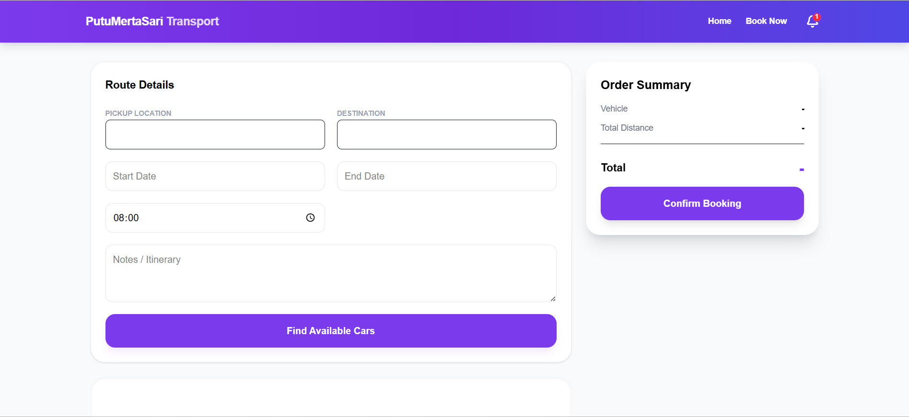
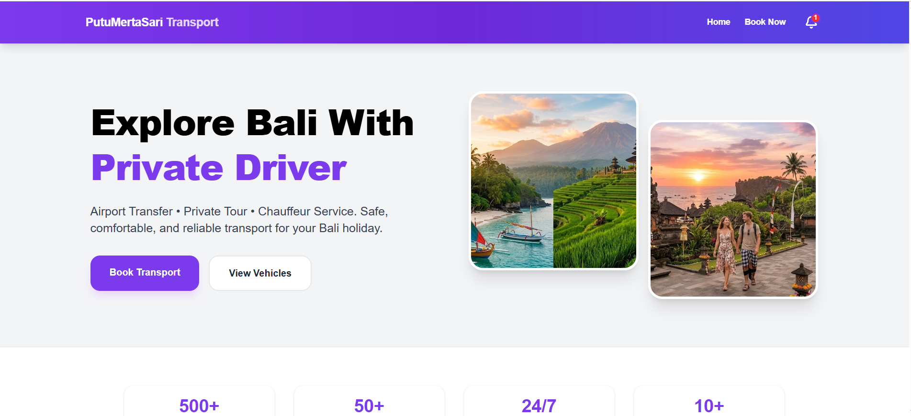
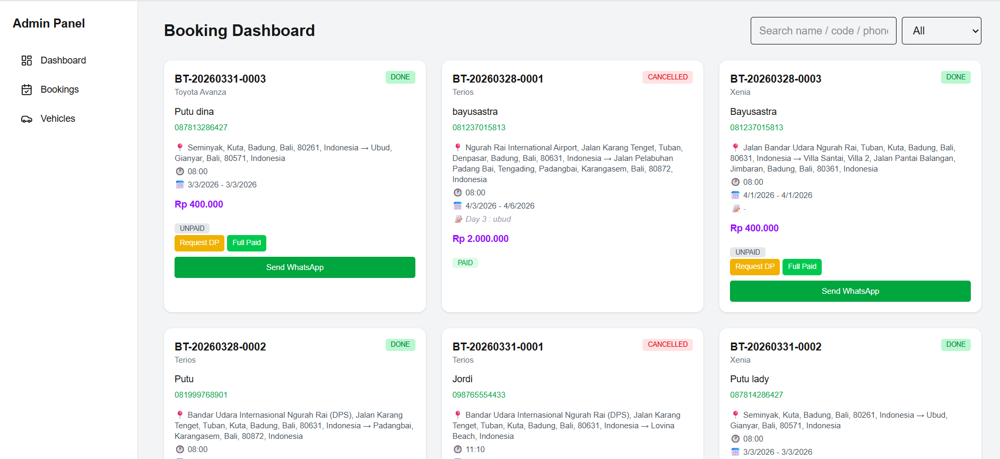

# 🌐 TravelApp Frontend (Next.js)

The official web interface for **[Mertasari Trans](https://mertasaritrans.com/)**. This dashboard provides a seamless experience for managing travel operations, from fleet tracking to booking management.

## 🔗 Project Links
- **Live Website:** [https://mertasaritrans.com/](https://mertasaritrans.com/)
- **Backend API Repository:** [bayusastra70/TravelApp-Backend](https://github.com/bayusastra70/TravelApp-Backend)

## ✨ Key Features
- **Interactive Dashboard:** Real-time visualization of daily bookings and fleet status.
- **Fleet Calendar:** A centralized calendar view to monitor vehicle schedules and driver assignments.
- **Booking Management:** Full CRUD capabilities for bookings with instant status updates via the NestJS API.
- **Responsive UI:** Built with Tailwind CSS for optimal performance on tablets and desktops.

## 🏗 Tech Stack
- **Framework:** Next.js (React)
- **Styling:** Tailwind CSS
- **API Fetching:** Axios / SWR

## 🚀 Development
1. **Clone & Install:** `npm install`
2. **Environment:** Set `NEXT_PUBLIC_API_URL` in `.env.local`.
3. **Run:** `npm run dev`

## Screenshots

  

 

  

 

  

 

---
**Developed by [bayusastra70](https://github.com/bayusastra70)**
